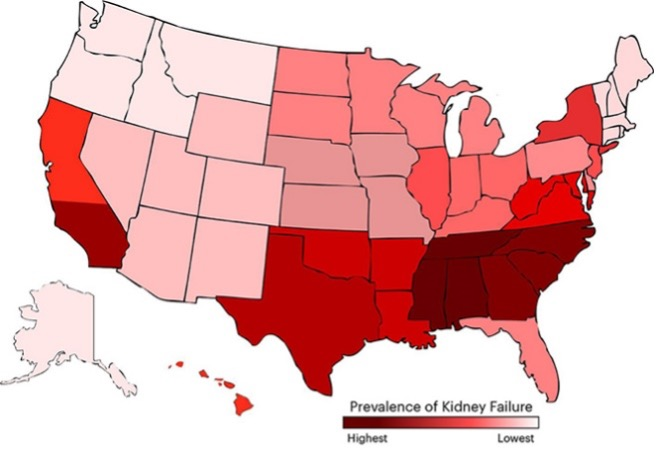

# Screening-for-Chronic-Kidney-Disease-CKD

This project developed a prediction model from a dataset comprising of people tested for chronic kidney disease (CKD) and provided a screening tool with 91% accuracy that can identify individuals with a higher risk of having CKD. 

Combined with medical research and statistical analysis, we identified Age, Obesity, Peripheral Vascular Disease (PVD), Hypertension, Diabetes, Cardio-Vascular Disease (CVD), Congestive Heart Failure (CHF), and Anemia are the key variables for identifying the possibility of having CKD. By applying logistic regression with a thorough consideration of selecting the threshold as 0.2, we defined the weights of each variable providing the scores in the screening tool.
